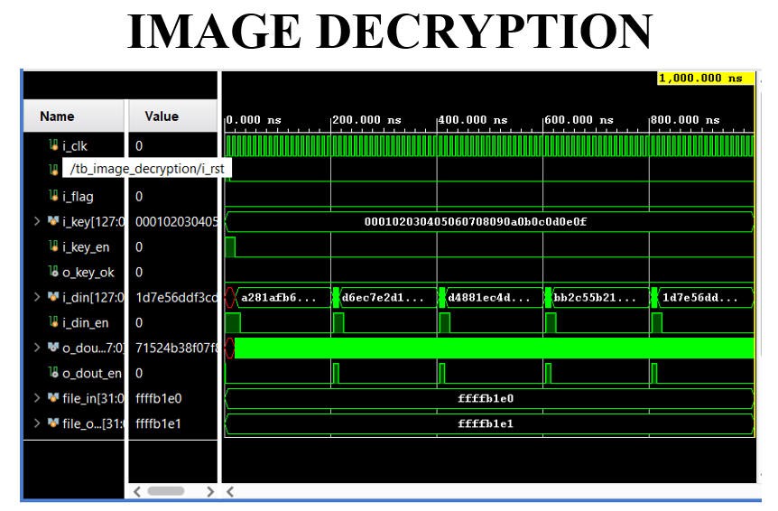

# RC6 Image Encryption and Decryption

RC6-based image encryption and decryption system designed for secure image transmission and cryptographic analysis.  
The project implements the RC6 symmetric block cipher for encrypting image data and reconstructing the original image through decryption.

This work demonstrates cryptographic algorithm implementation, bit-level data processing, and hardware-oriented design concepts relevant to embedded systems and digital design.

---

## 🔐 Overview

Digital images contain sensitive information and require secure storage and transmission.  
This project applies the RC6 encryption algorithm to image data by converting pixel values into binary form, encrypting them using key-dependent transformations, and reconstructing the original image through decryption.

The implementation combines:

- Python → image preprocessing and binary conversion  
- Verilog → RC6 encryption/decryption logic  
- Testbench → functional verification  
- Simulation → waveform validation  

---

## ⚙️ System Architecture

The encryption pipeline consists of:

1. Image input  
2. Pixel-to-binary conversion  
3. RC6 encryption core  
4. Encrypted image generation  
5. RC6 decryption  
6. Image reconstruction  

---

## 🧠 RC6 Algorithm Features

- Symmetric block cipher (128-bit block)
- Data-dependent rotations
- Modular addition and XOR operations
- Key-dependent transformations
- Strong diffusion and confusion properties

---

## 🧪 Verification

The RC6 RTL design was functionally verified using a Verilog testbench.  
Simulation waveforms confirm correct encryption and decryption behavior for 128-bit data blocks.

### Encryption Waveform

### Decryption Waveform

---

## 🏗️ Implementation Details

**Languages**
- Python
- Verilog HDL

**Tools**
- Python IDLE 3.12
- NumPy
- Xilinx Vivado

**Platform**
- Simulation-based implementation

---

## 📊 Results

- Successful encryption of image into unintelligible cipher image  
- Accurate decryption restoring original image  
- Verified functional correctness via simulation  
- Demonstrated secure image transmission capability  

---

## 📂 Repository Structure
rc6-image-encryption-verilog/
│
├── 1_RTL_Code/
│ ├── rc6_core.v
│ ├── rc6_dpc.v
│ ├── rc6_keyex.v
│ ├── rc6_rol.v
│
├── 2_Testbench_Code/
│ ├── rc6_tb.v
│
├── 3_Python_Code/
│ ├── image_to_binary.py
│ ├── binary_to_image.py
│
├── 4_Output/
│ ├── encrypted_image.png
│ ├── decrypted_image.png
│ ├── encryption_waveform.png
│ ├── decryption_waveform.png
│
└── README.md

---

## 🚀 Applications

- Secure image transmission  
- Embedded cryptographic systems  
- Confidential multimedia storage  
- Hardware security research  
- Military and medical image protection  

---

## 📘 Publication

**RC6-Based Image Encryption: A Secure Approach for Confidential Image Transmission**  
International Journal for Modern Trends in Science and Technology, 2025

---

## 👨‍💻 Author

**Manoj Kumar Naik Mudu**  
B.Tech Electronics and Communication Engineering  

---

## 📜 License

Academic and educational use.
